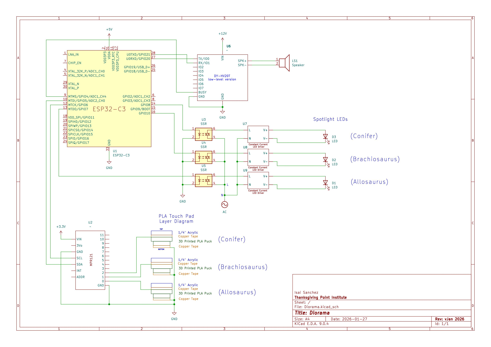

# Diorama Touch Pads

## Overview

The capacitive touch sensing firmware for the Diorama pads in the Rise of the Giants exhibit at Thanksgiving Point. Features a custom MPR121 class, extended from [Adafruit's MPR121 Library](https://github.com/adafruit/Adafruit_MPR121), that configures baseline tracking registers, applies ema filtering to ensure touch events are detected with thick acrylic overlays, and has additional logic that triggers sound playback and LED spotlights efficiently.

## Hardware

- **[Adafruit MPR121](https://www.adafruit.com/product/1982?gad_source=1&gad_campaignid=21079227318&gbraid=0AAAAADx9JvQkAsO7RS9bBB6XvtT1bf9lk&gclid=CjwKCAiAz_DIBhBJEiwAVH2XwDNIsjXkWfC8uAxjFRL1-COz-OxQyJIywEJ_eRMTO43w4skTKTorZRoCbN8QAvD_BwE)** - 12-channel capacitive touch sensor breakout
- **[SparkFun Pro Micro ESP32-C3](https://www.sparkfun.com/sparkfun-pro-micro-esp32-c3.html)** - Microcontroller with native USB and UART
- **DY-HV20T** - 20W audio playback module for triggered/UART sound playback
- **Touch Pads** - 3x custom PLA touch pads covered with copper tape for ease of soldering (see `docs/` for more info on construction)
- **LED Spotlights** - 3x LED Spotlights with AC-DC constant current drivers

## Wiring Diagram

